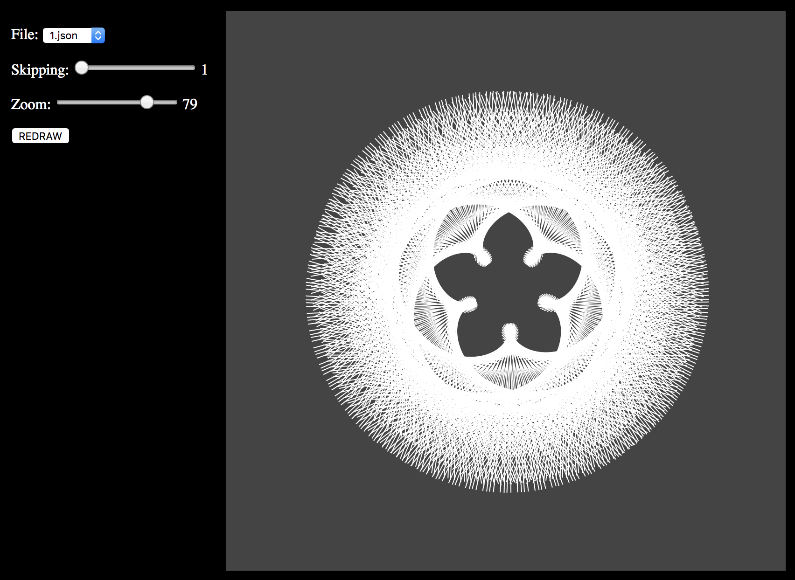

# Celestial body visualization hack

Data from Kepler [Concordia](http://concordia.world/) project, Hartmut Warm and Keplerstern.de

Data converted from raw text files with a node script included `utils/converter.js`

[Try it here](https://lab.possan.se/concordia/index.html)
